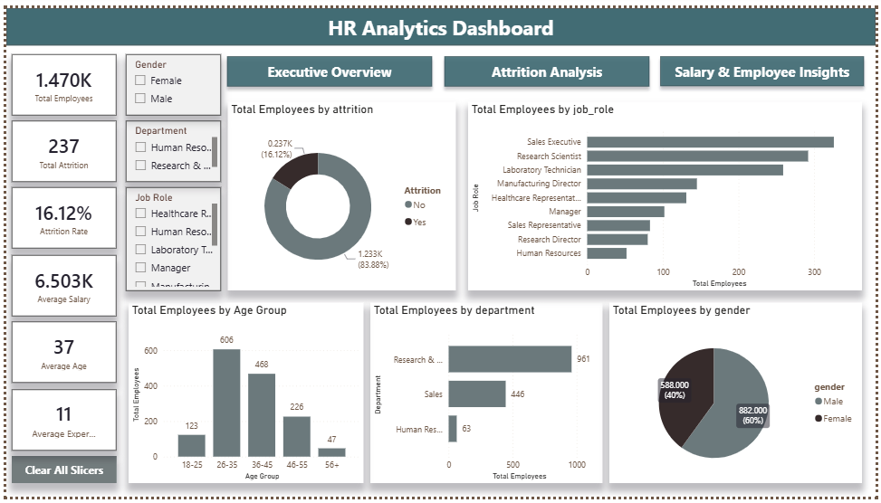
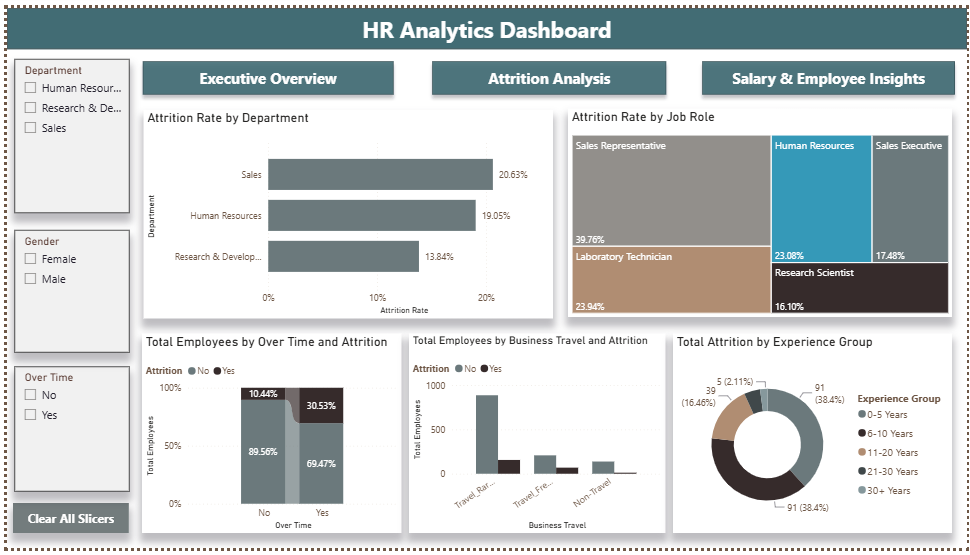
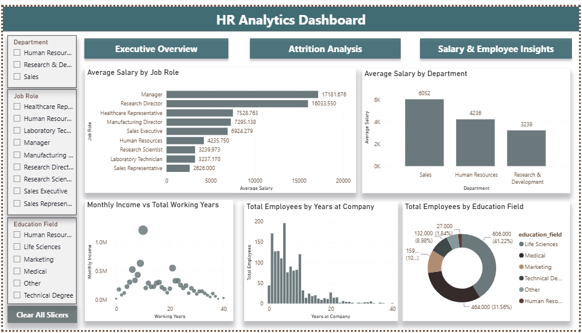

# 📊 IBM HR Analytics Dashboard

An end-to-end HR Analytics project that analyzes employee attrition and workforce trends using **Python**, **SQL**, and **Power BI**. The project transforms raw HR data into meaningful business insights through data cleaning, exploratory data analysis (EDA), SQL-based analysis, and an interactive dashboard.

---

## 📌 Project Overview

Employee attrition is one of the biggest challenges for organizations. This project analyzes the IBM HR Analytics dataset to identify the factors affecting employee turnover, employee demographics, salary distribution, and workforce performance.

The project follows a complete data analytics workflow:

```
Raw Dataset
     │
     ▼
Python
(Data Cleaning & EDA)
     │
     ▼
PostgreSQL
(Business Queries)
     │
     ▼
Power BI
(Interactive Dashboard)
     │
     ▼
Business Insights
```

---

## 📂 Dataset

- **Dataset:** IBM HR Analytics Employee Attrition & Performance
- **Source:** https://www.kaggle.com/datasets/pavansubhasht/ibm-hr-analytics-attrition-dataset

---

# 🛠 Tools & Technologies

| Tool | Purpose |
|------|---------|
| Python | Data Cleaning & EDA |
| Pandas | Data Manipulation |
| NumPy | Numerical Operations |
| Matplotlib | Data Visualization |
| Seaborn | Statistical Visualization |
| PostgreSQL | Business Analysis |
| Power BI | Dashboard Development |
| Git & GitHub | Version Control |

---

# 📁 Project Structure

```
IBM-HR-Analytics/
│
├── dashboard/
│   ├── hr_analytics_dashboard.pbix
│   ├── dashboard_page1.png
│   ├── dashboard_page2.png
│   └── dashboard_page3.png
│
├── data/
│   └── hr_employee_attrition.csv
│
├── notebook/
│   ├── HR_Analytics_EDA.ipynb
│   └── HR_Analytics_EDA.py
│
├── output/
│   └── cleaned_hr_employee_data.csv
│
├── sql/
│   ├── 01_database_setup.sql
│   └── 02_business_queries.sql
│
├── requirements.txt
├── .gitignore
└── README.md
```

---

# 🧹 Data Cleaning

The dataset was cleaned using Python by:

- Removing unnecessary columns
- Renaming columns using snake_case
- Creating Attrition Flag
- Creating OverTime Flag
- Removing extra spaces
- Creating Age Group
- Creating Experience Group
- Creating Income Category
- Handling missing values
- Exporting cleaned dataset

---

# 📈 Exploratory Data Analysis (EDA)

The EDA focused on identifying workforce trends including:

- Employee attrition rate is approximately 16%, indicating that employee retention is a significant challenge for the organization.
- The Research & Development department has the largest workforce, followed by Sales, making these departments the primary focus for workforce planning and retention strategies.
- Employees who work overtime are considerably more likely to leave the organization, suggesting a strong relationship between overtime and attrition.
- The majority of employees fall within the 26–35 years age group, representing the largest segment of the workforce.
- Monthly income generally increases with total working experience, indicating a positive correlation between employee experience and compensation.
- Employees with lower work-life balance ratings tend to experience higher attrition, highlighting the importance of employee well-being and work-life policies.
- Most employees have relatively fewer years at the company, suggesting a younger workforce with opportunities to improve long-term employee retention.

---

# 🗄 SQL Analysis

SQL was used to perform business analysis on the cleaned HR dataset. The analysis focused on workforce distribution, employee attrition, salary trends, experience levels, and department-wise performance.

Key analyses performed include:

- Workforce distribution across departments and job roles
- Overall employee attrition and attrition rate
- Department-wise and job role-wise attrition analysis
- Salary comparison across departments and job roles
- Overtime and its impact on employee attrition
- Gender distribution across the organization
- Work-life balance and employee retention
- Employee experience and tenure analysis
- Income category analysis
- Performance rating and salary hike analysis

## Key Business Insights

- Approximately 16% of employees left the organization.
- Employees who worked overtime showed significantly higher attrition.
- Sales and Research & Development departments accounted for the majority of attrition cases.
- Early-career employees experienced higher turnover than experienced employees.
- Monthly income generally increased with total working experience.
- Employees reporting poor work-life balance had higher attrition rates.

---

# 📊 Dashboard

The Power BI dashboard consists of **3 interactive pages**.

## 📌 Page 1 – Executive Overview

Provides a high-level overview of the organization's workforce, including employee count, attrition, department distribution, job roles, age groups, and gender composition. This page helps stakeholders quickly understand the current workforce profile.

**Visualizations**:

- KPI Cards
- Attrition Overview
- Employees by Department
- Employees by Job Role
- Employees by Age Group
- Gender Distribution



---

## 📌 Page 2 – Attrition Analysis

Focuses on identifying the factors influencing employee attrition by analyzing departments, job roles, overtime, business travel, work-life balance, and employee experience.

**Visualizations**:

- Attrition by Department
- Attrition by Job Role
- Overtime vs Attrition
- Business Travel vs Attrition
- Experience Group vs Attrition
- Work-Life Balance vs Attrition


---

## 📌 Page 3 – Salary & Employee Insights

Analyzes salary distribution and employee demographics to understand compensation trends, workforce experience, education, and tenure across the organization.

**Visualizations**:

- Average Salary by Department
- Average Salary by Job Role
- Salary vs Experience
- Years at Company
- Education Field



---

# 📌 Business Recommendations

- Reduce excessive overtime through better workload planning.
- Improve employee engagement in high-attrition departments.
- Strengthen retention strategies for new employees.
- Review compensation for lower income groups.
- Promote work-life balance initiatives.
- Provide career development opportunities for early-career employees.

---

# ▶️ How to Run

### Clone Repository

```bash
git clone https://github.com/yourusername/IBM-HR-Analytics.git
```

### Install Dependencies

```bash
pip install -r requirements.txt
```

### Run Python Analysis

```bash
python notebook/HR_Analytics_EDA.py
```

### Open Dashboard

Open

```
dashboard/hr_analytics_dashboard.pbix
```

using Microsoft Power BI Desktop.

---

# 👨‍💻 Author

**Sumit Chauhan**

LinkedIn: [LinkedIn Profile](https://www.linkedin.com/in/sumit-chauhan-980322423/)

GitHub: [GitHub Profile](https://github.com/sumit-commit)

---

## ⭐ If you found this project useful, consider giving it a star!